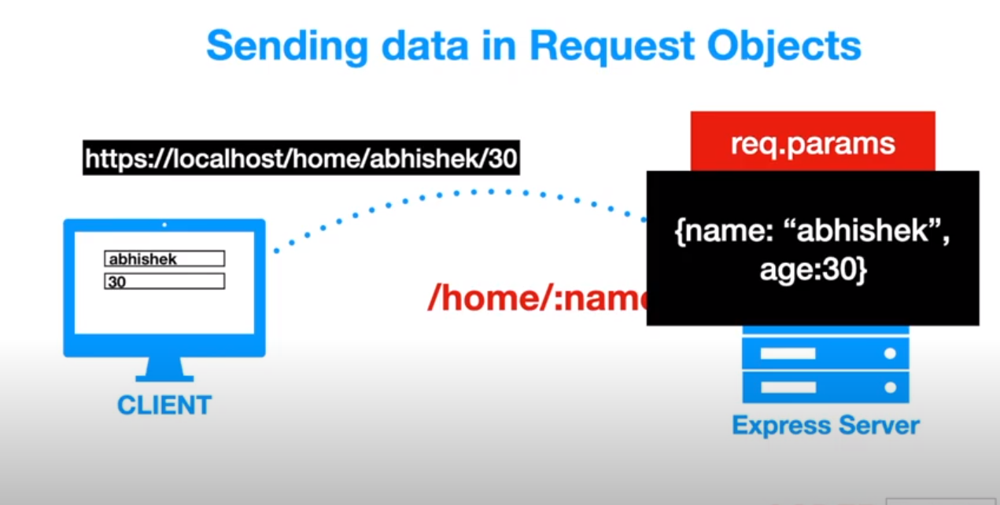

# Node.js Tutorial
# JavaScript Background
- Javascript was developed in 1995 in just 10 days along with JavaScript Engine and that engine was called as SpiderMonker and brower was NetEscape.

# Engine to run JavaScript code
- Later Chrome cameup with a better JavaScript engine called V8 engine and  that became popular.
V8 was making JavaScript code into machine readable code.

- V8 was till then only was used in the browser.

# Future Questions with JavaScript ability


### Then Question Aries ?
## 1. Can we used JavaScript everywhere, like mobile, desktop, Server(Backend) etc , cross-platform?

## Solution

  - Then they used V8 to build a RunTime environment, which will work on the machine. This platform is called Node.js
  - Node.js is basically ASYNCHRONUS && EVENT-DRIVEN && JAVASCRIPT RUNTIME ENVIRONMENT, where you can run JavaScript code. So using Node.js, you can run JavaScript on a standalone machine, not just browser.
  - Node.js is an open-source, cross-platform, back-end JavaScript runtime environment that runs on the V8 engine and executes JavaScript code outside a web browser.

### Then Question Aries ?
## 2. How can JavaScript be used in Mobile/Desktop ? 

## Solution

  - Then they cameup with different framework like React, Angular, to build those application which are (cross-platform) like iOS & Android.


### Then Question Aries ?
## 3. How can JavaScript be used in Server(Backend) side ? 

  Idea : What if we can use HTTP Module or HTTP component inside NODE.js ?

## Solution

- The moment we have the http power, we can use Node.js on the server side.
- This make Node.js as server side component.


### Then Question Aries ?
## 4. Now do we have a framework to build a web application?

## Solution
- Express.js is a backend framework to build a web application on server side, where Node.js is server side runtime engine.
- We have different frontend framework like React/Angular to build to build UI, and 
- MongoDB on Node.js as database backend.


### Then Question Aries ?
## 5. What does Node.js has which provided additional functionality/Libraries?

## Solution
- It has NPM (Node Package Manager) which provides different libraries to build or add features.
- NPM is a package manager for the JavaScript programming language maintained by npm, Inc. 
- This provides a third-party library to use.


# Installation Requirement
    - Visual Studio, MongoDB, Node.js
# Libuv Inbuild-library

### Then Question Aries ?
## 6. What makes Node.js  supports NON-BLOCKING I/O and ASYNCHRONUS SINGLE THREAD PROCESSING ?

### So Node.js  supports NON-BLOCKING I/O and ASYNCHRONUS SINGLE THREAD PROCESSING with help of Libuv.

- Behind the scenes, Node.js uses external library called Libuv, which is built in C lang and has multiple thread.
- Libuv helps Node.js achieve ASYNCHRONUS SINGLE THREAD PROCESSING as it has multiple thread/work which has callback function and work is done parallely by single thread of Node.js. 
- Node.js achieve NON-BLOCKING I/O as libuv provide multiple worker and i/o is never blocked.


### NOTE: Node.js is used for I/O intensive work, but not CPU intensive work.

# Global objects
```
console.log();

setTimeout();
clearTimeout();

setInterval();
clearInterval();
```
These are the global object provided by JavaScript, that can run in server,frontend and browser.

These are accessible as window's objects ex: window.console.log();

### Note: But in Node.js we don't have WINDOW object rather we have GLOBAL object

- In Node.js we have these accessible as window's objects ex: global.console.log();

# MODULE 

- Every file in a Node.js application is considered as a MODULE.
- ** The variables and functions defined in that file or that module are scoped to that module, as in they are private.

   ## How to use UserCreated Module outside the scope?

    ## Solution
    
    - The Module is needed to explicitly exported and make it public. 
    Try : console.log(module)
    - Every module has id,exports:{},parent,filename,children,paths.
    Anything added in exports will be added in {} empty object.

    

   
    ## Syntax:
     ```
     >> logger.js

    function log(message){
        console.log(message);
    }
    module.exports.log=log;

    >> app.js

    const logger = require('log');
    console.log(logger);
     logger.log('Hello, you module has been exported')

     >> OUTPUT : 
        {log:[Function:log]}  
        Hello, you module has been exported
    ```


# PATH Definers
    - ./logger.js : indicates current folder
    - ./subFolder/logger.js : indicates that file is in sub-folder
    - ../parentFolder/logger.js : indicates that file is in parent-folder

# FILE SYSTEM 

## Notes:
- writeFile() is used to write data to file.
- appendFile() is used to append data to file.
- readFile() is used to read data from file.
- open() is used to open file & r+ is read/write format specifier for file.
- unlink() is used to detete file.
 ## Syntax:
    
```
// writeFile() is used to write data to file.
fs.writeFile('hello.txt','This is Anurag',(err) => {
    if(err)throw err;
    else{
        console.log('Data was Written successfully')
    }
})

// appendFile() is used to append data to file.
fs.appendFile('hello.txt',' This is second line.',(err)=>{
    if(err)throw err;
    else console.log("Data Appended successfully.")
})

// readFile() is used to read data from file.
fs.readFile('hello.txt',(err, data)=>{
    if(err)throw err;
    else console.log("Data Read successfully : "+data.toString())
})

// open() is used to open file & r+ is read/write format specifier for file.
fs.open('hello.txt','r+',(err, data) => {
    if(err){
       console.log(err);
    }else{
        console.log("Open and read successfully");
        
    }
});

// unlink() is used to detete file.
fs.unlink('hello.txt',(err)=>{
    if(err)throw err;
    else console.log("Data Deleted/Unlink successfully")
})
```


# HTTP module
Node.js has multiple modules available, there are inbuild module and user created module, which help to achieve the idea of modularity and flexibility, where different components are working together.

HTTP Module - inbult Module.

- Here createServer() is function available in Module called HTTP module, which is responsible for creating Server.

 ## Syntax:

```
      createServer((req,res)=>{})

        const http = require('http')
        http.createServer((req,res)=>{
            res.write('Hello World');
            res.end()
        }).listen(3000)

```

# ExpressJS Framework

Express is a simple framework build on the top of Node.js. 


### Note : npm init -y  this command help to create a default package manager file called package.json

### Package required :
```
npm install express 
This command install express in node_modules
```
### 1. Express.js for Static Public File Hosting

### Notes :
- use() function we is used to define any middleware.
- express.static() is middleware, comes with express.js , which hold the path to the static public hosting files.
- Here express.js loads index.html to the server and displays the it on server.
- Static Hosting means that they are publicly accessible.
```
>index.js

const express = require('express');
const app = express(); // Here express is initialized 

app.use(express.static('public')) // Here express automatically loads the public paths

app.listen(8080,() => {
    console.log('listening on port 8080')
});

>public >index.html

<html> 
    <body>
        <h1>Welcome</h1>
    </body>
</html>
```

### 2. Express.js for creating EndPoint / API

### Notes :
- get() method  tell the type of API request is made, comes with express.js. 
- It takes two parameters PATH and a CALLBACK function.
- It is a GET request endPoint, which fetch data from path mentioned and then does the CALLBACK.


```
>index.js

const express = require('express');
const app = express(); // Here express is initialized 

//1.Sending String to server
app.get('/hello', function(req, res){
    res.send('Hello, world')
})

//2.Sending JSON data to server
app.get('/hello', function(req, res){
    res.json({text:'Hello World'})
})

app.listen(8090,() => {
    console.log('listening on port 8090')
});

http://localhost:8090/hello

```
# SENDING DATA IN REQUEST OBJECTS
## Request Object
- When we send Request Object in the login path, Request object can have REQUEST LINE,HEADERS, BODY


- A Request Object has following 
   - Method's request type like GET,POST,PUT,DELETE
   - Header retrives cookies,auth or token 
   - REQUEST BODY : Body retrives Data.
   - REQUEST URL : URL retrives Query String & Params


# A. REQUEST URL
## 1. QUERY STRING
### Sending data in Request Object through QUERY STRING
- In the below example ?name=anurag&age=25 is a QUERY STRING
- Where '&' differentiate between two variables.


### How to send data in Request Object
- req.query is an inbuild property of Express.js.
- Here Express.js access Request Object from the URL using req.query.
- req.query is mmostly used in GET query.


```
>index.js

const express = require('express');
const app = express(); // Here express is initialized 

//2.Sending JSON data to server
app.get('/person', function(req, res){

    let personName=req.query.name;
    let age=req.query.age;
    res.json({name:personName,age})
})

app.listen(8090,() => {
    console.log('listening on port 8090')
});

http://localhost:8090/person?name=anurag&age=25

```


- Here the data is received from client directly from  Query String (res.query) on server.
## 2.  QUERY PARAMS / URL Params / Request Parameters 
### Sending data in Request Object through QUERY PARAMS

- https://localhost/home/anurag/25 : URL + URL Params
- In the above example /anurag/25 is a URL PARAMS
- We have to predefined in the server before hand, the type of parameter format.
    - Ex: /anurag/25 => /:name/:age
    - The information related to /:name/:age get stored query.params
    - query.params return the data in JSON format.
    - Here Express.js matches the Server Path /home/:name/:age with home/anurag/25 & assign values accordingly.


### How to send data in Request Object in QUERY PARAMS URL
- req.params is an inbuild property of Express.js.
- Here Express.js access Request Object from the URL using req.params.
- req.params is mostly used in GET query.


```
>index.js

const express = require('express');
const app = express(); // Here express is initialized 

//2.Sending JSON data to server
app.get('/school/:name/:city', function(req, res){
  
    let nameStudent=req.params.name;
    let cityName=req.params.city;
    res.json({name:nameStudent,city:cityName});
})

app.listen(8091,() => {
    console.log('listening on port 8091')
});

// http://localhost:8090/school/MIT/Boston

```



- Here the data is received from client directly from  Query Params (res.params) on server.


# B. REQUEST BODY
### Sending data in Request Object through REQUEST BODY


