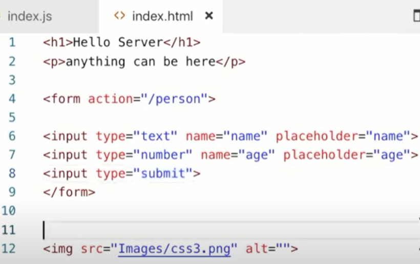

# Node.js Tutorial
# JavaScript Background
- Javascript was developed in 1995 in just 10 days along with JavaScript Engine and that engine was called as SpiderMonker and brower was NetEscape.

# Engine to run JavaScript code
- Later Chrome cameup with a better JavaScript engine called V8 engine and  that became popular.
V8 was making JavaScript code into machine readable code.

- V8 was till then only was used in the browser.

# Future Questions with JavaScript ability


### Then Question Aries ?
## 1. Can we used JavaScript everywhere, like mobile, desktop, Server(Backend) etc , cross-platform?

## Solution

  - Then they used V8 to build a RunTime environment, which will work on the machine. This platform is called Node.js
  - Node.js is basically ASYNCHRONUS && EVENT-DRIVEN && JAVASCRIPT RUNTIME ENVIRONMENT, where you can run JavaScript code. So using Node.js, you can run JavaScript on a standalone machine, not just browser.
  - Node.js is an open-source, cross-platform, back-end JavaScript runtime environment that runs on the V8 engine and executes JavaScript code outside a web browser.
  - Thus we can use JavaScript on Node RunTime environment,making it available to be used in all platform like server side, client side and top of database.

### Then Question Aries ?
## 2. How can JavaScript be used in Mobile/Desktop ? 

## Solution

  - Then they cameup with different framework like React, Angular, to build those application which are (cross-platform) like iOS & Android.
  - This make Node.js as client side component.


### Then Question Aries ?
## 3. How can JavaScript be used in Server(Backend) side ? 

  Idea : What if we can use HTTP Module or HTTP component inside NODE.js ?

## Solution

- The moment we have the http power, we can use Node.js on the server side.
- This make Node.js as server side component.


### Then Question Aries ?
## 4. Now do we have a framework to build a web application?

## Solution
- Express.js is a backend framework to build a web application on server side, where Node.js is server side runtime engine.
- We have different frontend framework like React/Angular to build to build UI, and 
- MongoDB on Node.js as database backend.


### Then Question Aries ?
## 5. What does Node.js has which provided additional functionality/Libraries?

## Solution
- It has NPM (Node Package Manager) which provides different libraries to build or add features.
- NPM is a package manager for the JavaScript programming language maintained by npm, Inc. 
- This provides a third-party library to use.


# Installation Requirement
    - Visual Studio, MongoDB, Node.js
# Libuv Inbuild-library

### Then Question Aries ?
## 6. What makes Node.js  supports NON-BLOCKING I/O and ASYNCHRONUS SINGLE THREAD PROCESSING ?

### So Node.js  supports NON-BLOCKING I/O and ASYNCHRONUS SINGLE THREAD PROCESSING with help of Libuv.

- Behind the scenes, Node.js uses external library called Libuv, which is built in C lang and has multiple thread.
- Libuv helps Node.js achieve ASYNCHRONUS SINGLE THREAD PROCESSING as it has multiple thread/work which has callback function and work is done parallely by single thread of Node.js. 
- Node.js achieve NON-BLOCKING I/O as libuv provide multiple worker and i/o is never blocked.


### NOTE: Node.js is used for I/O intensive work, but not CPU intensive work.

# Global objects

- These are the global object provided by JavaScript, that can run in server,frontend and browser.
- These are accessible as window's objects provided by JavaScript ex: window.console.log();
- In browser the global object is `window`, but in Node the global object is `global`
- Try : console.log(global);

### OUTPUT:


```
console.log();

setTimeout(); // This function gonna run it once after set timer.
clearTimeout();

setInterval(); // This function gonna run every second or interval set.
clearInterval();

```

```
Example:

console.log(global);

** console.log(__dirname); //This gets the absoulute path of the folder
** console.log(__filename); //This gets the absoulute path of the file 

setTimeout(()=>{
    console.log('in the timeout');
    clearInterval(int); //this clears the interval
},2000);

const int = setInterval(()=>{console.log('in the interval')},1000);
```
### Note: But in Node.js we don't have WINDOW object rather we have GLOBAL object

- In Node.js we have these accessible as window's objects ex: global.console.log();

# NODE.js MODULE & Require('')

- Every file in a Node.js application is considered as a `MODULE`.
- ** The `variables and functions` defined in that file or that `module` are scoped to that module, as in they are `private`.
- Node.js includes three types of modules:
    1. Core Modules
    2. Local Modules
    3. Third Party Modules
- In order to use Node.js core or NPM modules, you first need to import it using require() function as shown below.

```var module = require('module_name');```


- Try : console.log(module)
- Every module has id,exports:{},parent,filename,children,paths.
- Anything added in exports will be added in {} empty object.
  

    


   ## Q. How to use UserCreated Module outside the scope?

    ## Solution
    
    - The Module is needed to explicitly exported and make it public. 
  
    ### Require() : 
    - require(./..) finds the module to be exported and run the file.
    - module.exports=people; //Single method
    - module.exports= { people : people, ages : ages} ; //Multiple method
   
    ## Example for exporting user defined single Object:
     ```
     
    >> 11_module_1.js
     
        var people = ['Anurag','Shreya','Riya','Neal','Kimmy','Ryan']
        console.log("This is from 1st file : "+people);
        module.exports=people;

    >> 11_module_2.js
        
        const xyz = require('./11_module_1');
        console.log('This from second file : '+xyz); //This return an empty object.
     
     >> OUTPUT : node 11_module_2.js
     
        This is from 1st file : Anurag,Shreya,Riya,Neal,Kimmy,Ryan
        This from second file : Anurag,Shreya,Riya,Neal,Kimmy,Ryan
    ```

   ## Example for exporting user defined Multiple Object:
     ```
     
    >> 11_module_1.js
     
        var people = ['Anurag','Shreya','Riya','Neal','Kimmy','Ryan']
        var ages = [26,27,22,25,27,28]
        console.log("This is from 1st file : "+people);
        module.exports= { people : people, ages : ages} ; // Tip : Better to use the same variable name!!

    >> 11_module_2.js
        
        const {people,ages} = require('./11_module_1');
        console.log(people,ages)
     
     >> OUTPUT : node 11_module_2.js
     
        This is from 1st file : Anurag,Shreya,Riya,Neal,Kimmy,Ryan
        { people: [ 'Anurag', 'Shreya', 'Riya', 'Neal', 'Kimmy', 'Ryan' ],
        ages: [ 26, 27, 22, 25, 27, 28 ] }
    ```

    ## Example for exporting user defined Function/Method:
     ```
     
    >> 11_module_1.js
     
       module.exports = function (firstName, lastName) {
        this.firstName = firstName;
        this.lastName = lastName;
        this.fullName = function () { 
        return this.firstName + ' ' + this.lastName;
            }
        }

    >> 11_module_2.js
        
        var person = require('./11_module_1.js');
        var personName = new person('James', 'Bond');
        console.log(personName.fullName());
     
     >> OUTPUT : node 11_module_2.js
     
        C:\> node 11_module_1.js
        James Bond

    ```

# PATH Definers
    - ./logger.js : indicates current folder
    - ./subFolder/logger.js : indicates that file is in sub-folder
    - ../parentFolder/logger.js : indicates that file is in parent-folder

# FILE SYSTEM 

## Notes:
- writeFile() is used to write data to file.
- appendFile() is used to append data to file.
- readFile() is used to read data from file.
- open() is used to open file & r+ is read/write format specifier for file.
- unlink() is used to detete file.
- mkdir() is used create folder directory
- rmdir() is used delete folder directory
- existsSync() is used to block the code for a very little amount of time as it's ASYNCHRONUS, and used to check if something exists.
 ## Syntax:
    
```
-----------------------------------------------------------------------------------------------
// writeFile() is used to write data to file.
// It takes 3 parameters, filename| text to be written | CallBack function 

fs.writeFile('hello.txt','This is Anurag',(err) => {
    if(err)throw err;
    else{
        console.log('Data was Written successfully')
    }
})
-----------------------------------------------------------------------------------------------
// appendFile() is used to append data to file.
// It takes 3 parameters, filename| text to be written | CallBack function

fs.appendFile('hello.txt',' This is second line.',(err)=>{
    if(err)throw err;
    else console.log("Data Appended successfully.")
})
-----------------------------------------------------------------------------------------------
// readFile() is used to read data from file.
// It takes 2 parameters, filename | CallBack function 

fs.readFile('hello.txt',(err, data)=>{
    if(err)throw err;
    else console.log("Data Read successfully : "+data.toString())
})
-----------------------------------------------------------------------------------------------
// open() is used to open file & .
// It takes 3 parameters, filename| r+ is read/write format specifier for file | CallBack function

fs.open('hello.txt','r+',(err, data) => {
    if(err){
       console.log(err);
    }else{
        console.log("Open and read successfully");
        
    }
});
-----------------------------------------------------------------------------------------------
// unlink() is used to detete file.
// It takes 2 parameters, filename | CallBack function -> err & data

fs.unlink('hello.txt',(err)=>{
    if(err)throw err;
    else console.log("Data Deleted/Unlink successfully")
})
-----------------------------------------------------------------------------------------------
// mkdir() is used access folder directory
// It takes 2 parameters, filename | CallBack function -> err & data

if(!fs.existsSync('./assests)){
fs.mkdir('./assets',(err)=>{
    if(err)throw err;
    else console.log("Folder created")
})
} else {
    fs.rmdir('./assets',(err)=>{
    if(err)throw err;
    else console.log("Folder deleted")
})
}
-----------------------------------------------------------------------------------------------
```

# STREAMS
 - Using `Streams` we can start using the data before it's fully been read.
 - Used for live streaming of data.
 - Types of streams:
    - a) createReadStream()
        - const readStream = createReadStream('./filepath,{encoding:'utf8'})
        - readStream.on('data',(chunk)=>{}) 
        - `.on()` is an data event listener that takes `Data Event` and `function takes chunk of data`.
    - b) createWriteStream()
        - const writeStream = createWriteStream('./filepath)
        - writeStream.write(chunk)
        - write() is used to write the chunk of data.

    - c) `pipe()` is used to pass data directly from readStream to writeStream only.
        - readStream.pipe(writeStream)
        - This is much easier way to write and lesser code.


# HTTP Module || Node.js Web Server
Node.js has multiple modules available, there are inbuild module and user created module, which help to achieve the idea of modularity and flexibility, where different components are working together.

HTTP Module - inbult Module.

- const http = require('http'); is used to import `HTTP Module`.
- Here createServer() is function available in Module called HTTP module. 
- Which is responsible for creating Server.
- createServer() takes a callback function and it run everytime a `Request` comes in to server and send back `Response` to user in browser.
- listen() is used to listen the PORT.


 ## Syntax:

```
const http = require('http');
http.createServer((req,res)=>{})
```

```
Example
        const http = require('http')
        http.createServer((req,res)=>{
            res.write('Hello World');
            res.end()
        }).listen(3000)

```
## Request & Response


# ExpressJS Framework || ExpressJS Web Server

Express is a simple framework build on the top of Node.js. 


### Note : npm init -y  this command help to create a default package manager file called package.json

### Package required :
```
npm install express 
This command install express in node_modules
```
### 1. Express.js for Static Public File Hosting

### Notes :
- use() function we is used to define any middleware.
- express.static() is middleware, comes with express.js , which hold the path to the static public hosting files.
- Here express.js loads index.html to the server and displays the it on server.
- Static Hosting means that they are publicly accessible.
```
>index.js

const express = require('express');
const app = express(); // Here express is initialized 

app.use(express.static('public')) // Here express automatically loads the public paths

app.listen(8080,() => {
    console.log('listening on port 8080')
});

>public >index.html

<html> 
    <body>
        <h1>Welcome</h1>
    </body>
</html>
```

### 2. Express.js for creating EndPoint / API

### Notes :
- get() method  tell the type of API request is made, comes with express.js. 
- It takes two parameters PATH and a CALLBACK function.
- It is a GET request endPoint, which fetch data from path mentioned and then does the CALLBACK.


```
>index.js

const express = require('express');
const app = express(); // Here express is initialized 

//1.Sending String to server
app.get('/hello', function(req, res){
    res.send('Hello, world')
})

//2.Sending JSON data to server
app.get('/hello', function(req, res){
    res.json({text:'Hello World'})
})

app.listen(8090,() => {
    console.log('listening on port 8090')
});

http://localhost:8090/hello

```

- NOTE : The json() method of the Response interface takes a Response stream and reads it to completion. It returns a promise which resolves with the result of parsing the body text as JSON Ex: response.json()
# SENDING DATA IN REQUEST OBJECTS
## Request Object
- When we send Request Object in the login path, Request object can have REQUEST LINE,HEADERS, BODY


- A Request Object has following 
   - Method's request type like GET,POST,PUT,DELETE
   - Header retrives cookies,auth or token 
   - REQUEST BODY : Body retrives Data.
   - REQUEST URL : URL retrives Query String & Params


# A. REQUEST URL
## 1. QUERY STRING
### Sending data in Request Object through QUERY STRING
- In the below example ?name=anurag&age=25 is a QUERY STRING
- Where '&' differentiate between two variables.


### How to send data in Request Object
- req.query is an inbuild property of Express.js.
- Here Express.js access Request Object from the URL using req.query.
- req.query is mmostly used in GET query.


```
>index.js

const express = require('express');
const app = express(); // Here express is initialized 

//2.Sending JSON data to server
app.get('/person', function(req, res){

    let personName=req.query.name;
    let age=req.query.age;
    res.json({name:personName,age})
})

app.listen(8090,() => {
    console.log('listening on port 8090')
});

http://localhost:8090/person?name=anurag&age=25

```


- Here the data is received from client directly from  Query String (res.query) on server.
## 2.  QUERY PARAMS / URL Params / Request Parameters 
### Sending data in Request Object through QUERY PARAMS

- https://localhost/home/anurag/25 : URL + URL Params
- In the above example /anurag/25 is a URL PARAMS
- We have to predefined in the server before hand, the type of parameter format.
    - Ex: /anurag/25 => /:name/:age
    - The information related to /:name/:age get stored query.params
    - query.params return the data in JSON format.
    - Here Express.js matches the Server Path /home/:name/:age with home/anurag/25 & assign values accordingly.


### How to send data in Request Object in QUERY PARAMS URL
- req.params is an inbuild property of Express.js.
- Here Express.js access Request Object from the URL using req.params.
- req.params is mostly used in GET query.


```
>index.js

const express = require('express');
const app = express(); // Here express is initialized 

//2.Sending JSON data to server
app.get('/school/:name/:city', function(req, res){
  
    let nameStudent=req.params.name;
    let cityName=req.params.city;
    res.json({name:nameStudent,city:cityName});
})

app.listen(8091,() => {
    console.log('listening on port 8091')
});

// http://localhost:8090/school/MIT/Boston

```


- Here the data is received from client directly from  Query Params (res.params) on server.


# B. REQUEST BODY
### Sending data in Request Object through REQUEST BODY


- We can send data in body.
- The data is hidden in body, can't view in the URL.
- method='post' triggers the post method and data is sent to body from UI, and
- action='' is the Endpoint address is given.
- JSON data can be sent to body.


- Currently in Express.js 'req.body' doesn't parse the body so instead of that we use a middleware.
- bodyParser is the middleware that parse the JSON data, and it has two format.
    - bodyParser.urlencoded() can used for Form Data
    - bodyParser.json() can used for JSON Data.
- With help of bodyParser, req.body will fetch the data.
- bodyParser comes with Express.js, so we need to require('bodyParser')


## POST Request BODY
- POST Request allow the data to be sent along with the request in form of REQUEST BODY.
- (data + request=>BODY REQUEST)
- Whenever a POST Request is made , it means that ,the server that receives that POST request saves the data.

### Not ever Request Method contains a body. ex: GET Request don't contain a body.

## body-parser
- Parse incoming request bodies in a middleware before your handlers, available under the req.body property.
- As req.body's shape is based on user-controlled input, all properties and values in this object are untrusted and should be validated before trusting.
### Express route-specific
This example demonstrates adding body parsers specifically to the routes that need them. 
In general, this is the most recommended way to use body-parser with Express.

```
const express = require('express');
const server = express();
var bodyParser = require('body-parser')

// create application/json parser using bodyParser
var jsonParser = bodyParser.json()
// create application/x-www-form-urlencoded parser using bodyParser
var urlencodedParser = bodyParser.urlencoded({ extended: false })

// Here in Parameters, we need to pass urlencodedParser in parameter, as data passed in this post as urlencoded

server.post('/login/1',urlencodedParser,(req,res)=>{
  res.send('Welcome '+req.body.name)
  console.log(req.body)
})

// Here in Parameters, we need to pass jsonParser in parameter, as data passed in this post as JSON

server.post('/login/2',jsonParser,(req,res)=>{
  res.send('Welcome '+req.body.name)
  console.log(req.body)
})
server.listen(8070,()=>{ console.log('The Server is live on 8070')})

```

### Express/Connect top-level generic
  - This example demonstrates adding a generic JSON and URL-encoded parser as a top-level middleware,
    which will parse the bodies of all incoming requests. This is the simplest setup.
 
```
const express = require('express');
const server = express();
var bodyParser = require('body-parser')

// parse application/json using EXPRESS
server.use(express.json()); 
parse application/x-www-form-urlencoded using EXPRESS
server.use(express.urlencoded({    
  extended: true
})); 

(OR)

// parse application/x-www-form-urlencoded
server.use(bodyParser.urlencoded({ extended: false }))
// parse application/json
server.use(bodyParser.json())

// pass data as URLencoded
server.post('/login/3',(req,res)=>{
  res.send('Welcome '+req.body.name)
  console.log(req.body)
})

// pass data as JSON
server.post('/login/4',(req,res)=>{
  res.send('create user in req.body when sending JSON data')
  console.log(req.body)
})

server.listen(8070,()=>{ console.log('The Server is live on 8070')})

```
- pass data as JSON


- pass data as Urlencoded


# We have learn 3 ways of sending data to the server

## QUERY STRING

- Query strings are the data that appear in a page URL. 
- They are appended after the URL path and preceded by a question mark. 
- Each of them take the form of name-value pair. 
- Since they appear in the URL, they’re not confidential. 
- Query strings start with a question mark and each name-value pair are separated by an ampersand `&`
- http://localhost:8050/person2?name=anurag&age=26&mail=a@gmail.com
## QUERY PARAMS

- Parameters don’t take the name-value form; they don’t need any key. Simply append the value to the URL right after the path. 
- To prevent confusion with query strings,
    - Make sure that parameters aren’t preceded by a question mark
    - They are appended right after the URL path
    - They are succeeded by query strings.
    - http://localhost:8050/person/anurag/a@gmail.com/26
## BODY Parser


- Add method = 'POST', in form after action.


# REST API

- What is a REST API?
    - REST : Respresentational State Transfer
        - REST is architectural style of web.
        - A standard set of guideline by which we can structure and create API's
    - API : Application Programming Interface
    - They make use of HTTP methods.
        - GET - Used to *retrive data from the server
        - POST - Used to *send data to the server.
        - PUT - Used to *update data.
        - DELETE - Used to *delete data.

    - REST Properties : The make use of HTTP Status codes
        - 200 means OK
        - 404 means resource not found
        - 500 means server error


# Synchronus and Asynchronous 
- Sync Process : STEP By STEP process and block other steps.
- Async Process : Exceutes Parallel Process, doesn't block other steps.

In a `synchronous programming model`, things happen one at a time. When you call a function that performs a long-running action, it returns only when the action has finished and it can return the result. This stops your program for the time the action takes.

An `asynchronous model` allows multiple things to happen at the same time. When you start an action, your program continues to run. When the action finishes, the program is informed and gets access to the result


 ###  From EVENT-QUEUE the EVENT is either passed to MAIN THREAD (CPU Task) or  THREAD-POOL(I/O Task).

    - Async sends I/O Event directly to Thread Pool from event-queue, and then callback is used to acknowledge the event processed and send to back to event-queue for CPU processing, and then goes to main-thread and response is sent back.

    - Sync sends Event directly to be processed by Main thread and response is sent back.


## Q&A
- When you say async task is processed , is what we call task processed in thread-pool, right?
    - YES

- Async task gets processed in thread-pool?
    - YES

- So Sync process, ex: writeFileSync this blocks till work is done?
    - YES, because Sync task are directly processed by Main thread.

- In current enterprised based aplication , which one is more preffered Async or sync?
    - Aysnc is more preffered.

# PROMISES & CALLBACK


## ISSUE WITH CALLBACK
    With Callback function we loose control over the Callback function processing. For example:
        1. With the management of the error 
        2. Number of times it's called isn't under control.
        3. When it's called isn't under control.

- The fix to the problem is PROMISES

 ##   PROMISES
- This issue can be fixed by Promises, gives controlled uses of callback.
    1. Does callback ones which is under control.
    2. Handles Error more elegantly.

- A new Promises takes a callback function and that callback function takes two parameters :
  -  Resolve : Does the same thing as callback, pushing task to Event-Queue when ready. Resolve is only called once in a promise.
  -  Reject  : This is called when there are any errors.
  -  .then() : Takes two Parameter : 1.onfulfilled 2.onrejected
     * Attaches callbacks for the resolution and/or rejection of the Promise.
     * @param onfulfilled The callback to execute when the Promise is resolved.
     * @param onrejected The callback to execute when the Promise is rejected.
     * @returns A Promise for the completion of which ever callback is executed.
     